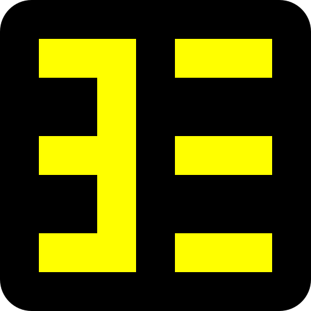

<div align="center">



# 白い熊 Yomitan

**Read anything in the browser — hover a word, get the reading, the meaning and the pitch — in 白い熊 火狐, on the desktop and on Android.**

A personal fork of [Yomitan](https://github.com/yomidevs/yomitan), the pop-up dictionary that
succeeded Yomichan, carrying its own add-on ID and its own black-and-yellow identity so it installs
**alongside** an unmodified Yomitan rather than replacing it.

📥 **[Latest release](https://github.com/ShiroiKuma0/shiroikuma-kako-yomitan/releases/latest)** — a
Mozilla-signed `.xpi` that installs in any Firefox.

</div>

## What it does

Hover over a word on any page and a popup gives its readings, definitions, pitch accent, inflection
chain and kanji stroke order. It works **entirely offline**: dictionaries are yours to import —
JMdict, monolingual 明鏡 or 新明解, NHK pitch data, frequency lists, EPWING through the importer —
in more than twenty languages. On top of the dictionary sits the whole mining apparatus: one-click
Anki cards through AnkiConnect with Handlebars field templates, audio sources, a clipboard monitor
for reading text from outside the browser, a standalone search page, and per-profile settings with
conditions.

Nothing is sent anywhere by default except the audio request you trigger yourself.

## What this fork changes

The fork is a thin layer over upstream: an identity, an icon, and one behaviour patch. That is
deliberate — the smaller the diff, the more cleanly it replays onto each new upstream release.

### 🆔 Its own add-on identity

`yomitan@shiroikuma`, permanently ours. AMO will not sign an ID registered to somebody else, add-on
updates are keyed to the ID forever, and owning it is what lets this build sit beside an unmodified
Yomitan in the same profile.

### 🎨 A black-and-yellow icon, derived from upstream's own vector master

Upstream draws its icon in `resources/icons.svg` as two shapes — a rounded tile and the katakana
ヨミ. Both are lifted verbatim into `graphics/icon.svg`; only the fills change, to pure yellow
`#FFFF00` on black. Nothing is redrawn, so it still reads as the same extension. All fourteen assets
regenerate from that one master with `python3 graphics/make-icons.py`.

### 🌗 A toolbar icon that shows when scanning is off

Upstream marks the disabled state with a small grey `off` badge and nothing else, which is easy to
miss. This fork dims the icon itself to `#666600` while scanning is disabled, so the state is legible
at a glance. Upstream's badge is left exactly as it was.

### 🔗 Our name and our links throughout

The extension name, the toolbar tooltip, the context-menu entry, every page title and heading, and
every link — source, releases, issues, wiki, privacy policy — carry this fork's identity. Store
review links are dropped: this build is on no store. What is deliberately **not** renamed is the
"Yomitan" that is an interoperability name rather than branding — the **Yomitan API** native
component, the **Yomitan dictionary format** third parties publish in, and the GPL copyright line.

### 🔢 A version that says which upstream it is

`26.7.29.1` is our first build on upstream's `26.7.29.0`. Firefox and AMO allow only four
dot-separated integers and upstream already uses all four, so the last component carries both
counters: upstream's `P` and ours `N`, as `P×100 + N`.

## Installing

Download the signed `.xpi` from the [latest release](https://github.com/ShiroiKuma0/shiroikuma-kako-yomitan/releases/latest).
It is signed by Mozilla on the unlisted channel, so it installs in **any** Firefox, including stock
release builds, without being published or reviewed on AMO. 白い熊 火狐 takes it directly on the
desktop, and on Android through its install-from-file support.

## Building

Needs **Node ≥ 22** and `web-ext`. The system `node` is 18, so select a newer one first:

```bash
. ~/.nvm/nvm.sh && nvm use 24
npm ci                              # once, or after a dependency change
node tools/build-fork.mjs           # unsigned: build -> ~/tmp/*.xpi, bump the build counter
node tools/build-fork.mjs --sign    # release only: AMO-signed .xpi
```

Iterate unsigned — 白い熊 火狐 is built with `MOZ_REQUIRE_SIGNING` unset and installs unsigned
builds directly. Every signing run is an AMO round-trip that burns a version number for good.

## Fork model

| Branch   | Role                                                                    |
| -------- | ----------------------------------------------------------------------- |
| `master` | a pure mirror of `upstream/master`, fast-forward only                   |
| `custom` | all fork work, a small stack rebased onto each upstream **release tag** |

`/upstream-new-version` does the sync: it describes what the new upstream release brings, waits for
a go-ahead, then fast-forwards the mirror, rebases the stack, resets the build counter, folds
upstream's notes into the changelog and rebuilds.

## Credit and licence

Everything that makes this extension good is upstream's work:
[yomidevs/yomitan](https://github.com/yomidevs/yomitan), itself the successor to Foosoft's Yomichan.
GPL-3.0, as upstream is.
